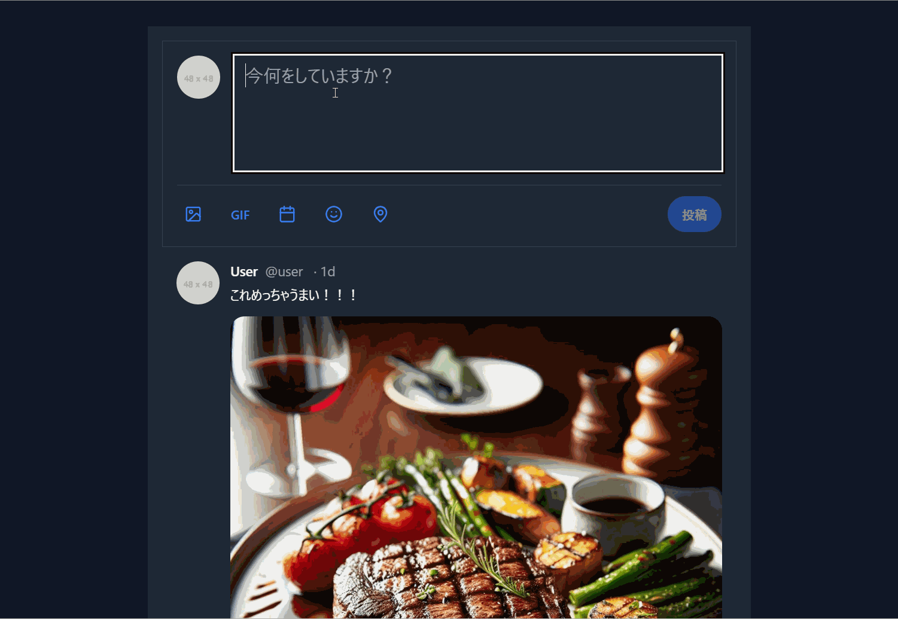

## SUCCESSBLESS

SUCCESSBLESS は、AIを活用し、SNSのような感覚で目標達成をサポートするWebアプリケーションです。ユーザーは目標達成を投稿し、それに対してAIが応援コメントや評価を返します。まるでSNSで仲間と交流しているかのような感覚で、楽しく目標達成を進めることができます。

### 特徴

- **AIフィードバック:** ユーザーの投稿に対して、AIがコメントや評価を提供します。
- **SNSの要素:** フォロワー数、いいね、評価など、SNSでおなじみの機能を搭載しています。
- **リアルなレスポンス生成:** Gemini APIを利用し、人間らしいフィードバックを実現しています。
- **多様なAIキャラクター:** 様々な性格のAIキャラクターが、投稿に返信してくれます。
- **ランダム性:** 同じ投稿でも評価が変わることがあり、ゲーム感覚で楽しめます。

### 開発の背景

開発者は、多くの人が仕事や目標達成に対して十分な達成感を感じられていない現状を問題視していました。そこで、SNSの中毒性に着目し、それを目標達成に活用できないかと考えました。SUCCESSBLESSは、SNSの楽しさを目標達成に結びつけることで、ユーザーがモチベーションを維持し、目標を達成できるよう支援することを目指しています。

### 技術スタック

- **フレームワーク:** Svelte
- **API:** Gemini API, Gemini1.5Flash
- **AI:** Claude (コーディング支援)
- **ホスティング:** GitHub Pages

### 利用方法

SUCCESSBLESSは無料で利用できます。広告もありません。GitHub Pagesで公開されているので、GeminiAPIキーを用意すればすぐに使い始めることができます。

### 今後の展望

開発者は、今後もSUCCESSBLESSの機能追加や改良を続ける予定です。将来的には、目標達成をより効果的に支援するアプリケーションの開発も目指しています。

### ぜひお試しください！

SUCCESSBLESSは、目標達成に悩むすべての人におすすめのアプリケーションです。AIの応援を受けながら、楽しく目標を達成しましょう。

